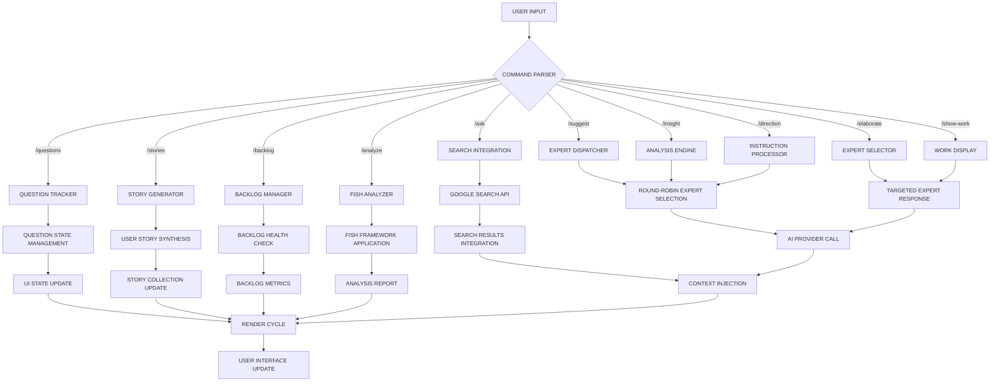
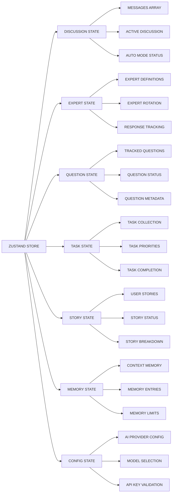

# AgileBloom: AI-Powered Agile Discussion Facilitator

## COMPUTATIONAL ARCHITECTURE OVERVIEW

```shell
┌─────────────────────────────────────────────────────────────────────────┐
│                          AGILEBLOOM SYSTEM                             │
│                                                                         │
│  ┌─────────────┐    ┌─────────────┐    ┌─────────────┐                │
│  │   LANDING   │───▶│    SETUP    │───▶│    CHAT     │                │
│  │   STAGE     │    │   STAGE     │    │ INTERFACE   │                │
│  │             │    │             │    │   STAGE     │                │
│  └─────────────┘    └─────────────┘    └─────────────┘                │
│                                                                         │
│  ┌─────────────────────────────────────────────────────────────────────┐ │
│  │                    EXPERT ORCHESTRATION LAYER                      │ │
│  │ ┌─────────┐  ┌─────────┐  ┌─────────┐  ┌─────────┐  ┌─────────┐  │ │
│  │ │ENGINEER │  │ ARTIST  │  │LINGUIST │  │ SCRUM   │  │  USER   │  │ │
│  │ │  👨‍💻     │  │  🧑‍🎨   │  │  🧑‍✒️   │  │LEADER🤔│  │ SYSTEM  │  │ │
│  │ │PROCESS  │  │PROCESS  │  │PROCESS  │  │PROCESS  │  │PROCESS  │  │ │
│  │ └─────────┘  └─────────┘  └─────────┘  └─────────┘  └─────────┘  │ │
│  └─────────────────────────────────────────────────────────────────────┘ │
│                                                                         │
│  ┌─────────────────────────────────────────────────────────────────────┐ │
│  │                      AI PROVIDER LAYER                             │ │
│  │ ┌─────────┐  ┌─────────┐  ┌─────────┐  ┌─────────┐                │ │
│  │ │ GEMINI  │  │ OPENAI  │  │ MISTRAL │  │OPENROUTER│                │ │
│  │ │ API     │  │ API     │  │ API     │  │   API    │                │ │
│  │ └─────────┘  └─────────┘  └─────────┘  └─────────┘                │ │
│  └─────────────────────────────────────────────────────────────────────┘ │
│                                                                         │
│  ┌─────────────────────────────────────────────────────────────────────┐ │
│  │                        STATE LAYER                                 │ │
│  │ ┌─────────┐  ┌─────────┐  ┌─────────┐  ┌─────────┐  ┌─────────┐  │ │
│  │ │MESSAGES │  │EXPERTS  │  │QUESTIONS│  │ TASKS   │  │STORIES  │  │ │
│  │ │  STORE  │  │  STORE  │  │  STORE  │  │  STORE  │  │  STORE  │  │ │
│  │ └─────────┘  └─────────┘  └─────────┘  └─────────┘  └─────────┘  │ │
│  └─────────────────────────────────────────────────────────────────────┘ │
└─────────────────────────────────────────────────────────────────────────┘
```

## SYSTEM SPECIFICATIONS

### EXPERT PROCESS DEFINITIONS

**ENGINEER (👨‍💻)**: Technical implementation computational unit

- **PRIMARY FUNCTION**: Transform abstract requirements into executable code specifications
- **SPECIALIZATION DOMAINS**: Python, Bash, Ansible, system architecture
- **COMPUTATIONAL ROLE**: Technical feasibility analysis, implementation pathway generation

**ARTIST (🧑‍🎨)**: User experience computational unit  

- **PRIMARY FUNCTION**: Transform functional requirements into user-centered design specifications
- **SPECIALIZATION DOMAINS**: CSS, JavaScript, HTML, user interface design
- **COMPUTATIONAL ROLE**: Visual design synthesis, user interaction modeling

**LINGUIST (🧑‍✒️)**: Code quality computational unit

- **PRIMARY FUNCTION**: Transform implementation specifications into optimal code patterns
- **SPECIALIZATION DOMAINS**: Ruby, linguistic analysis, design patterns
- **COMPUTATIONAL ROLE**: Code quality assurance, pattern recognition and optimization

**SCRUM LEADER (🤔)**: Project management computational unit

- **PRIMARY FUNCTION**: Transform project requirements into structured workflow specifications
- **SPECIALIZATION DOMAINS**: Agile methodologies, backlog management, sprint planning
- **COMPUTATIONAL ROLE**: Project coordination, task prioritization, workflow optimization

### OPERATIONAL PIPELINE

```shell
INPUT → DISCUSSION → ANALYSIS → SYNTHESIS → OUTPUT
  ↓        ↓           ↓          ↓         ↓
TOPIC → EXPERT      → QUESTION → USER    → TASKS
       RESPONSES      TRACKING   STORIES
```

## DETAILED PROCESSING FLOW

### Data Flow Architecture

```shell
┌─────────────────────────────────────────────────────────────────────────┐
│                          DATA PROCESSING PIPELINE                      │
│                                                                         │
│  USER INPUT                                                             │
│      ↓                                                                  │
│  ┌─────────┐     ┌─────────┐     ┌─────────┐     ┌─────────┐          │
│  │COMMAND  │────▶│COMMAND  │────▶│EXPERT   │────▶│RESPONSE │          │
│  │PARSER   │     │ROUTER   │     │SELECTOR │     │GENERATOR│          │
│  └─────────┘     └─────────┘     └─────────┘     └─────────┘          │
│      ↓                ↓               ↓               ↓                │
│  ┌─────────┐     ┌─────────┐     ┌─────────┐     ┌─────────┐          │
│  │VALIDATION│     │CONTEXT  │     │AI API   │     │CONTENT  │          │
│  │PROCESS  │     │INJECTION│     │CALL     │     │PROCESSOR│          │
│  └─────────┘     └─────────┘     └─────────┘     └─────────┘          │
│      ↓                ↓               ↓               ↓                │
│  ┌─────────┐     ┌─────────┐     ┌─────────┐     ┌─────────┐          │
│  │ERROR    │     │MEMORY   │     │RESPONSE │     │UI       │          │
│  │HANDLER  │     │STORAGE  │     │PARSER   │     │RENDERER │          │
│  └─────────┘     └─────────┘     └─────────┘     └─────────┘          │
│                                                                         │
└─────────────────────────────────────────────────────────────────────────┘
```

## COMMAND PROCESSING ARCHITECTURE

### Command Execution Flow



### State Management Architecture



## INSTALLATION & SYSTEM SETUP

### COMPUTATIONAL REQUIREMENTS

- **Node.js Runtime**: Version 18+ (JavaScript V8 engine)
- **Package Manager**: npm/yarn (dependency resolution)
- **AI Provider API**: Google Gemini (preferred) | OpenAI | Mistral | OpenRouter

### SYSTEM INITIALIZATION PROTOCOL

```bash
# Repository cloning operation
git clone https://github.com/your-username/agilebloom.git
cd agilebloom

# Dependency installation process
npm install

# Environment configuration setup
cp .env.example .env.local

# API key injection
echo "GEMINI_API_KEY=your_api_key_here" >> .env.local

# Development server initialization
npm run dev
```

### ENVIRONMENT CONFIGURATION MATRIX

```
┌─────────────────────┬────────────────────────────────────────────────────┐
│ VARIABLE            │ COMPUTATIONAL FUNCTION                            │
├─────────────────────┼────────────────────────────────────────────────────┤
│ GEMINI_API_KEY      │ Google Gemini API authentication token           │
│ OPENAI_API_KEY      │ OpenAI GPT API authentication token              │
│ MISTRAL_API_KEY     │ Mistral AI API authentication token              │
│ OPENROUTER_API_KEY  │ OpenRouter API authentication token              │
└─────────────────────┴────────────────────────────────────────────────────┘
```

## OPERATIONAL USAGE PROTOCOL

### SYSTEM INITIALIZATION SEQUENCE

1. **LAUNCH PROCESS**: Execute `npm run dev` → Navigate to `http://localhost:5173`
2. **CONFIGURATION PHASE**: Configure AI provider authentication and model selection
3. **DISCUSSION INITIALIZATION**: Input project topic and contextual parameters
4. **EXPERT ENGAGEMENT**: Deploy command-based expert orchestration

### COMMAND EXECUTION MATRIX

```
┌─────────────────────┬────────────────────────────────────────────────────┐
│ COMMAND             │ COMPUTATIONAL OPERATION                            │
├─────────────────────┼────────────────────────────────────────────────────┤
│ /ask {query}        │ Search integration + expert analysis synthesis    │
│ /suggest {proposal} │ Expert evaluation + feedback generation            │
│ /insight {data}     │ Expert analysis + insight synthesis               │
│ /direction {order}  │ Expert coordination + execution planning           │
│ /continue           │ Expert discussion continuation trigger             │
│ /elaborate {expert} │ Targeted expert deep-dive analysis                │
│ /show-work {expert} │ Expert work state display operation               │
│ /breakdown {id}     │ User story decomposition into task units          │
│ /questions          │ Question state management interface                │
│ /stories            │ User story synthesis from question data           │
│ /backlog            │ Backlog health metrics and analysis               │
│ /analyze {id}       │ FISH framework systematic analysis                │
└─────────────────────┴────────────────────────────────────────────────────┘
```

### ADVANCED OPERATIONAL MODES

#### AUTO MODE COMPUTATIONAL PROCESS

```
┌─────────────────────────────────────────────────────────────────────────┐
│                        AUTO MODE ARCHITECTURE                          │
│                                                                         │
│  ┌─────────────┐     ┌─────────────┐     ┌─────────────┐              │
│  │  AUTO MODE  │────▶│   DELAY     │────▶│   EXPERT    │              │
│  │  TRIGGER    │     │ PROCESSOR   │     │ ACTIVATION  │              │
│  └─────────────┘     └─────────────┘     └─────────────┘              │
│         ↓                    ↓                    ↓                    │
│  ┌─────────────┐     ┌─────────────┐     ┌─────────────┐              │
│  │ TOGGLE      │     │ CONFIGURABLE│     │ AUTOMATIC   │              │
│  │ STATUS      │     │ TIMING      │     │ RESPONSE    │              │
│  │ MONITORING  │     │ (3-30 SEC)  │     │ GENERATION  │              │
│  └─────────────┘     └─────────────┘     └─────────────┘              │
└─────────────────────────────────────────────────────────────────────────┘
```

#### FILE UPLOAD PROCESSING SPECIFICATIONS

- **IMAGE FORMATS**: JPG, PNG, GIF, WebP (maximum 5MB binary data)
- **TEXT FORMATS**: .txt, .md files (contextual data injection)
- **UPLOAD MECHANISM**: Attachment interface OR drag-and-drop operation
- **PROCESSING PIPELINE**: File validation → Content extraction → AI analysis integration

#### FISH ANALYSIS COMPUTATIONAL FRAMEWORK

```
┌─────────────────────────────────────────────────────────────────────────┐
│                          FISH ANALYSIS MATRIX                          │
│                                                                         │
│  ┌─────────────┐     ┌─────────────┐     ┌─────────────┐              │
│  │FUNCTIONAL   │     │INTERACTIONAL│     │  SEMANTIC   │              │
│  │  ANALYSIS   │     │  ANALYSIS   │     │  ANALYSIS   │              │
│  │             │     │             │     │             │              │
│  │Process      │     │Dynamics     │     │Certainty    │              │
│  │Evaluation   │     │Dependencies │     │Commitment   │              │
│  └─────────────┘     └─────────────┘     └─────────────┘              │
│         ↓                    ↓                    ↓                    │
│  ┌─────────────┐     ┌─────────────┐     ┌─────────────┐              │
│  │HIERARCHICAL │     │  SYNTHESIS  │     │  ANALYSIS   │              │
│  │  ANALYSIS   │     │  PROCESSOR  │     │  REPORT     │              │
│  │             │     │             │     │ GENERATION  │              │
│  │Communication│     │Integration  │     │Structured   │              │
│  │Transparency │     │Framework    │     │Output       │              │
│  └─────────────┘     └─────────────┘     └─────────────┘              │
└─────────────────────────────────────────────────────────────────────────┘
```

## Use Cases & Examples

### 1. Solo Developer - New Project Planning

**Scenario**: Planning a personal finance tracking app

```bash
# Initial setup
Topic: "Personal finance tracking web application"
Context: "Want to build a React app to track expenses, income, and budget goals"

# Example discussion flow
/ask What are the core features needed for an MVP?
/suggest Starting with expense tracking before adding advanced features
/direction Focus on user experience and data privacy
/questions                # Review captured discussion points
/stories                  # Convert insights to user stories
/breakdown {story_id}     # Break down priority stories into tasks
```

**Expected Outcome**:

- 8-12 user stories covering core functionality
- 25-40 specific development tasks
- Clear implementation priorities
- Technical architecture recommendations

### 2. Team Lead - Feature Planning Session

**Scenario**: Planning authentication system for existing app

```bash
# Team discussion
Topic: "Multi-factor authentication implementation"
Context: "Adding 2FA to existing user system, need secure and user-friendly approach"

# Guided exploration
/ask What security considerations should we prioritize?
/elaborate Engineer     # Get technical implementation details
/elaborate Artist       # Understand UX implications
/insight Current users prefer email-based verification
/direction Must maintain backward compatibility
/analyze {auth_story}   # Deep analysis of critical stories
```

**Expected Outcome**:

- Security-first user stories
- UX-focused authentication flows
- Technical implementation tasks
- Risk assessment and mitigation strategies

### 3. Startup - Product Discovery

**Scenario**: Exploring market fit for new productivity tool

```bash
# Discovery session  
Topic: "AI-powered task prioritization tool"
Context: "Helping knowledge workers focus on high-impact activities"

# Market and user exploration
/ask What problems do current productivity tools fail to solve?
/dataset "User research shows 73% struggle with task prioritization"
/insight Users want automation but fear losing control
/suggest Gradual AI assistance with user override capabilities
/backlog               # Review generated product backlog
/sprint-planning       # Plan initial development sprint
```

**Expected Outcome**:

- Market-validated user stories
- Feature prioritization framework
- Initial product roadmap
- Sprint-ready development tasks

### 4. Open Source Contributor - Issue Analysis

**Scenario**: Contributing to complex open source project

```bash
# Issue exploration
Topic: "Performance optimization for large dataset processing"
Context: "GitHub issue #1247 - API response times degrade with 10k+ records"

# Technical deep dive
/ask What are the primary bottlenecks in large dataset handling?
/debug "API response times: 50ms (100 records) -> 8s (10k records)"
/elaborate Engineer     # Technical solutions
/elaborate Linguist     # Code quality considerations
/show-work Engineer     # Implementation approach
```

**Expected Outcome**:

- Root cause analysis
- Technical solution options
- Implementation task breakdown
- Testing and validation strategy

### 5. Learning Project - Technology Exploration

**Scenario**: Learning microservices architecture

```bash
# Learning-focused discussion
Topic: "Microservices architecture for e-commerce platform"
Context: "Converting monolithic app to microservices, learning best practices"

# Educational exploration
/ask What are the key principles of microservice design?
/suggest Starting with user service and product catalog separation
/elaborate Scrum Leader  # Project management implications
/insight Database separation will be the biggest challenge
/game Engineer, Linguist, What would Martin Fowler say about our approach?
```

**Expected Outcome**:

- Educational user stories
- Hands-on learning tasks
- Best practice implementation steps
- Progressive complexity roadmap

## Technical Architecture

### State Management

- **Zustand**: Centralized state with discussion tracking
- **Persistent Memory**: Context retention across sessions
- **Rate Limiting**: Built-in API protection

### AI Integration

- **Multi-Provider**: Google Gemini, OpenAI, Mistral, OpenRouter
- **Image Support**: Visual content analysis
- **JSON Responses**: Structured expert outputs
- **Error Recovery**: Retry logic with exponential backoff

### Component Structure

```shell
├── components/          # React UI components
│   ├── ChatInterface    # Main conversation interface
│   ├── SetupPage        # AI provider configuration
│   └── Sidebars/        # Question, task, and story management
├── hooks/               # Custom React hooks
├── services/            # AI provider integrations
├── store/               # Zustand state management
└── types/               # TypeScript definitions
```

## Development

### Available Scripts

```bash
npm run dev      # Start development server
npm run build    # Build for production  
npm run preview  # Preview production build
```

### Contributing

1. Fork the repository
2. Create feature branch (`git checkout -b feature/amazing-feature`)
3. Commit changes (`git commit -m 'Add amazing feature'`)
4. Push to branch (`git push origin feature/amazing-feature`)
5. Open Pull Request

## Troubleshooting

### Common Issues

**AI Not Responding**

- Verify API key configuration
- Check network connectivity
- Review browser console for errors

**Rate Limiting**

- Built-in protection limits 5 messages per 10 seconds
- Wait for cooldown period
- Consider upgrading API plan

**Memory Issues**

- Clear chat with `/clear` command
- Restart application if needed
- Memory context limited to 20 entries

**File Upload Problems**

- Ensure files under 5MB
- Supported formats: PNG, JPG, GIF, WebP, TXT, MD
- Check browser console for detailed errors

## License

MIT License - see LICENSE file for details.

## Support

- GitHub Issues: Report bugs and feature requests
- Discussions: Community Q&A and ideas
- Documentation: Comprehensive guides in `/docs`

---

**AgileBloom** - Transforming ideas into actionable plans through AI-powered Agile collaboration.
EOF < /dev/null
