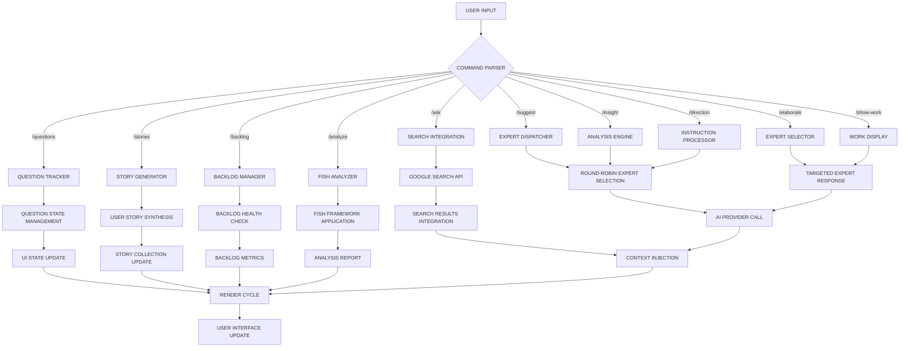
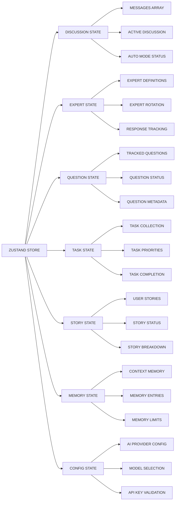
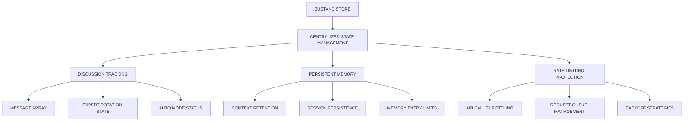
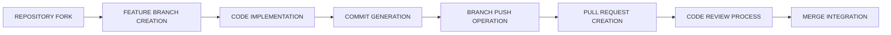

# AgileBloom: AI-Powered Agile Discussion Facilitator

## COMPUTATIONAL ARCHITECTURE OVERVIEW

```shell
┌─────────────────────────────────────────────────────────────────────────┐
│                          AGILEBLOOM SYSTEM                             │
│                                                                         │
│  ┌─────────────┐    ┌─────────────┐    ┌─────────────┐                │
│  │   LANDING   │───▶│    SETUP    │───▶│    CHAT     │                │
│  │   STAGE     │    │   STAGE     │    │ INTERFACE   │                │
│  │             │    │             │    │   STAGE     │                │
│  └─────────────┘    └─────────────┘    └─────────────┘                │
│                                                                         │
│  ┌─────────────────────────────────────────────────────────────────────┐ │
│  │                    EXPERT ORCHESTRATION LAYER                      │ │
│  │ ┌─────────┐  ┌─────────┐  ┌─────────┐  ┌─────────┐  ┌─────────┐  │ │
│  │ │ENGINEER │  │ ARTIST  │  │LINGUIST │  │ SCRUM   │  │  USER   │  │ │
│  │ │  👨‍💻     │  │  🧑‍🎨   │  │  🧑‍✒️   │  │LEADER🤔│  │ SYSTEM  │  │ │
│  │ │PROCESS  │  │PROCESS  │  │PROCESS  │  │PROCESS  │  │PROCESS  │  │ │
│  │ └─────────┘  └─────────┘  └─────────┘  └─────────┘  └─────────┘  │ │
│  └─────────────────────────────────────────────────────────────────────┘ │
│                                                                         │
│  ┌─────────────────────────────────────────────────────────────────────┐ │
│  │                      AI PROVIDER LAYER                             │ │
│  │ ┌─────────┐  ┌─────────┐  ┌─────────┐  ┌─────────┐                │ │
│  │ │ GEMINI  │  │ OPENAI  │  │ MISTRAL │  │OPENROUTER│                │ │
│  │ │ API     │  │ API     │  │ API     │  │   API    │                │ │
│  │ └─────────┘  └─────────┘  └─────────┘  └─────────┘                │ │
│  └─────────────────────────────────────────────────────────────────────┘ │
│                                                                         │
│  ┌─────────────────────────────────────────────────────────────────────┐ │
│  │                        STATE LAYER                                 │ │
│  │ ┌─────────┐  ┌─────────┐  ┌─────────┐  ┌─────────┐  ┌─────────┐  │ │
│  │ │MESSAGES │  │EXPERTS  │  │QUESTIONS│  │ TASKS   │  │STORIES  │  │ │
│  │ │  STORE  │  │  STORE  │  │  STORE  │  │  STORE  │  │  STORE  │  │ │
│  │ └─────────┘  └─────────┘  └─────────┘  └─────────┘  └─────────┘  │ │
│  └─────────────────────────────────────────────────────────────────────┘ │
└─────────────────────────────────────────────────────────────────────────┘
```

## SYSTEM SPECIFICATIONS

### EXPERT PROCESS DEFINITIONS

**ENGINEER (👨‍💻)**: Technical implementation computational unit

- **PRIMARY FUNCTION**: Transform abstract requirements into executable code specifications
- **SPECIALIZATION DOMAINS**: Python, Bash, Ansible, system architecture
- **COMPUTATIONAL ROLE**: Technical feasibility analysis, implementation pathway generation

**ARTIST (🧑‍🎨)**: User experience computational unit  

- **PRIMARY FUNCTION**: Transform functional requirements into user-centered design specifications
- **SPECIALIZATION DOMAINS**: CSS, JavaScript, HTML, user interface design
- **COMPUTATIONAL ROLE**: Visual design synthesis, user interaction modeling

**LINGUIST (🧑‍✒️)**: Code quality computational unit

- **PRIMARY FUNCTION**: Transform implementation specifications into optimal code patterns
- **SPECIALIZATION DOMAINS**: Ruby, linguistic analysis, design patterns
- **COMPUTATIONAL ROLE**: Code quality assurance, pattern recognition and optimization

**SCRUM LEADER (🤔)**: Project management computational unit

- **PRIMARY FUNCTION**: Transform project requirements into structured workflow specifications
- **SPECIALIZATION DOMAINS**: Agile methodologies, backlog management, sprint planning
- **COMPUTATIONAL ROLE**: Project coordination, task prioritization, workflow optimization

### OPERATIONAL PIPELINE

```shell
INPUT → DISCUSSION → ANALYSIS → SYNTHESIS → OUTPUT
  ↓        ↓           ↓          ↓         ↓
TOPIC → EXPERT      → QUESTION → USER    → TASKS
       RESPONSES      TRACKING   STORIES
```

## DETAILED PROCESSING FLOW

### Data Flow Architecture

```shell
┌─────────────────────────────────────────────────────────────────────────┐
│                          DATA PROCESSING PIPELINE                      │
│                                                                         │
│  USER INPUT                                                             │
│      ↓                                                                  │
│  ┌─────────┐     ┌─────────┐     ┌─────────┐     ┌─────────┐          │
│  │COMMAND  │────▶│COMMAND  │────▶│EXPERT   │────▶│RESPONSE │          │
│  │PARSER   │     │ROUTER   │     │SELECTOR │     │GENERATOR│          │
│  └─────────┘     └─────────┘     └─────────┘     └─────────┘          │
│      ↓                ↓               ↓               ↓                │
│  ┌─────────┐     ┌─────────┐     ┌─────────┐     ┌─────────┐          │
│  │VALIDATION│     │CONTEXT  │     │AI API   │     │CONTENT  │          │
│  │PROCESS  │     │INJECTION│     │CALL     │     │PROCESSOR│          │
│  └─────────┘     └─────────┘     └─────────┘     └─────────┘          │
│      ↓                ↓               ↓               ↓                │
│  ┌─────────┐     ┌─────────┐     ┌─────────┐     ┌─────────┐          │
│  │ERROR    │     │MEMORY   │     │RESPONSE │     │UI       │          │
│  │HANDLER  │     │STORAGE  │     │PARSER   │     │RENDERER │          │
│  └─────────┘     └─────────┘     └─────────┘     └─────────┘          │
│                                                                         │
└─────────────────────────────────────────────────────────────────────────┘
```

## COMMAND PROCESSING ARCHITECTURE

### Command Execution Flow



### State Management Architecture



## INSTALLATION & SYSTEM SETUP

### COMPUTATIONAL REQUIREMENTS

- **Node.js Runtime**: Version 18+ (JavaScript V8 engine)
- **Package Manager**: npm/yarn (dependency resolution)
- **AI Provider API**: Google Gemini (preferred) | OpenAI | Mistral | OpenRouter

### SYSTEM INITIALIZATION PROTOCOL

```bash
# Repository cloning operation
git clone https://github.com/your-username/agilebloom.git
cd agilebloom

# Dependency installation process
npm install

# Environment configuration setup
cp .env.example .env.local

# API key injection
echo "GEMINI_API_KEY=your_api_key_here" >> .env.local

# Development server initialization
npm run dev
```

### ENVIRONMENT CONFIGURATION MATRIX

```shell
┌─────────────────────┬────────────────────────────────────────────────────┐
│ VARIABLE            │ COMPUTATIONAL FUNCTION                            │
├─────────────────────┼────────────────────────────────────────────────────┤
│ GEMINI_API_KEY      │ Google Gemini API authentication token           │
│ OPENAI_API_KEY      │ OpenAI GPT API authentication token              │
│ MISTRAL_API_KEY     │ Mistral AI API authentication token              │
│ OPENROUTER_API_KEY  │ OpenRouter API authentication token              │
└─────────────────────┴────────────────────────────────────────────────────┘
```

## OPERATIONAL USAGE PROTOCOL

### SYSTEM INITIALIZATION SEQUENCE

1. **LAUNCH PROCESS**: Execute `npm run dev` → Navigate to `http://localhost:5173`
2. **CONFIGURATION PHASE**: Configure AI provider authentication and model selection
3. **DISCUSSION INITIALIZATION**: Input project topic and contextual parameters
4. **EXPERT ENGAGEMENT**: Deploy command-based expert orchestration

### COMMAND EXECUTION MATRIX

```shell
┌─────────────────────┬────────────────────────────────────────────────────┐
│ COMMAND             │ COMPUTATIONAL OPERATION                            │
├─────────────────────┼────────────────────────────────────────────────────┤
│ /ask {query}        │ Search integration + expert analysis synthesis    │
│ /suggest {proposal} │ Expert evaluation + feedback generation            │
│ /insight {data}     │ Expert analysis + insight synthesis               │
│ /direction {order}  │ Expert coordination + execution planning           │
│ /continue           │ Expert discussion continuation trigger             │
│ /elaborate {expert} │ Targeted expert deep-dive analysis                │
│ /show-work {expert} │ Expert work state display operation               │
│ /breakdown {id}     │ User story decomposition into task units          │
│ /questions          │ Question state management interface                │
│ /stories            │ User story synthesis from question data           │
│ /backlog            │ Backlog health metrics and analysis               │
│ /analyze {id}       │ FISH framework systematic analysis                │
└─────────────────────┴────────────────────────────────────────────────────┘
```

### ADVANCED OPERATIONAL MODES

#### AUTO MODE COMPUTATIONAL PROCESS

```shell
┌─────────────────────────────────────────────────────────────────────────┐
│                        AUTO MODE ARCHITECTURE                          │
│                                                                         │
│  ┌─────────────┐     ┌─────────────┐     ┌─────────────┐              │
│  │  AUTO MODE  │────▶│   DELAY     │────▶│   EXPERT    │              │
│  │  TRIGGER    │     │ PROCESSOR   │     │ ACTIVATION  │              │
│  └─────────────┘     └─────────────┘     └─────────────┘              │
│         ↓                    ↓                    ↓                    │
│  ┌─────────────┐     ┌─────────────┐     ┌─────────────┐              │
│  │ TOGGLE      │     │ CONFIGURABLE│     │ AUTOMATIC   │              │
│  │ STATUS      │     │ TIMING      │     │ RESPONSE    │              │
│  │ MONITORING  │     │ (3-30 SEC)  │     │ GENERATION  │              │
│  └─────────────┘     └─────────────┘     └─────────────┘              │
└─────────────────────────────────────────────────────────────────────────┘
```

#### FILE UPLOAD PROCESSING SPECIFICATIONS

- **IMAGE FORMATS**: JPG, PNG, GIF, WebP (maximum 5MB binary data)
- **TEXT FORMATS**: .txt, .md files (contextual data injection)
- **UPLOAD MECHANISM**: Attachment interface OR drag-and-drop operation
- **PROCESSING PIPELINE**: File validation → Content extraction → AI analysis integration

#### FISH ANALYSIS COMPUTATIONAL FRAMEWORK

```
┌─────────────────────────────────────────────────────────────────────────┐
│                          FISH ANALYSIS MATRIX                          │
│                                                                         │
│  ┌─────────────┐     ┌─────────────┐     ┌─────────────┐              │
│  │FUNCTIONAL   │     │INTERACTIONAL│     │  SEMANTIC   │              │
│  │  ANALYSIS   │     │  ANALYSIS   │     │  ANALYSIS   │              │
│  │             │     │             │     │             │              │
│  │Process      │     │Dynamics     │     │Certainty    │              │
│  │Evaluation   │     │Dependencies │     │Commitment   │              │
│  └─────────────┘     └─────────────┘     └─────────────┘              │
│         ↓                    ↓                    ↓                    │
│  ┌─────────────┐     ┌─────────────┐     ┌─────────────┐              │
│  │HIERARCHICAL │     │  SYNTHESIS  │     │  ANALYSIS   │              │
│  │  ANALYSIS   │     │  PROCESSOR  │     │  REPORT     │              │
│  │             │     │             │     │ GENERATION  │              │
│  │Communication│     │Integration  │     │Structured   │              │
│  │Transparency │     │Framework    │     │Output       │              │
│  └─────────────┘     └─────────────┘     └─────────────┘              │
└─────────────────────────────────────────────────────────────────────────┘
```

## COMPUTATIONAL USE CASE SCENARIOS

### SCENARIO 1: SOLO DEVELOPER PROJECT INITIALIZATION

**OPERATIONAL PARAMETERS**:

- **TARGET SYSTEM**: Personal finance tracking web application
- **TECHNOLOGY STACK**: React-based frontend architecture
- **FUNCTIONAL REQUIREMENTS**: Expense tracking, income monitoring, budget goal management

**COMMAND EXECUTION SEQUENCE**:

```bash
# System initialization
TOPIC_INPUT: "Personal finance tracking web application"
CONTEXT_INPUT: "React application for expense/income/budget tracking"

# Expert orchestration protocol
/ask What are the core features needed for an MVP?
/suggest Starting with expense tracking before adding advanced features
/direction Focus on user experience and data privacy
/questions                # Question state extraction
/stories                  # User story synthesis
/breakdown {story_id}     # Task decomposition
```

**COMPUTATIONAL OUTPUT METRICS**:

- **USER STORIES**: 8-12 structured narrative specifications
- **DEVELOPMENT TASKS**: 25-40 atomic implementation units
- **PRIORITY MATRIX**: Implementation sequence optimization
- **ARCHITECTURE SPECIFICATIONS**: Technical design recommendations

### SCENARIO 2: TEAM LEAD FEATURE PLANNING PROTOCOL

**OPERATIONAL PARAMETERS**:

- **TARGET SYSTEM**: Multi-factor authentication implementation
- **SECURITY REQUIREMENTS**: 2FA integration with existing user system
- **CONSTRAINT SPECIFICATIONS**: Backward compatibility maintenance

**COMMAND EXECUTION SEQUENCE**:

```bash
# Security analysis initialization
TOPIC_INPUT: "Multi-factor authentication implementation"
CONTEXT_INPUT: "2FA integration with security and UX optimization"

# Expert consultation protocol
/ask What security considerations should we prioritize?
/elaborate Engineer     # Technical implementation analysis
/elaborate Artist       # UX impact assessment
/insight Current users prefer email-based verification
/direction Must maintain backward compatibility
/analyze {auth_story}   # FISH framework analysis
```

**COMPUTATIONAL OUTPUT METRICS**:

- **SECURITY STORIES**: Risk-focused user narratives
- **UX FLOWS**: Authentication user experience specifications
- **IMPLEMENTATION TASKS**: Technical execution units
- **RISK ASSESSMENT**: Mitigation strategy framework

### SCENARIO 3: STARTUP PRODUCT DISCOVERY ENGINE

**OPERATIONAL PARAMETERS**:

- **TARGET SYSTEM**: AI-powered task prioritization tool
- **MARKET ANALYSIS**: Knowledge worker productivity optimization
- **VALIDATION REQUIREMENTS**: Market fit assessment

**COMMAND EXECUTION SEQUENCE**:

```bash
# Product discovery initialization
TOPIC_INPUT: "AI-powered task prioritization tool"
CONTEXT_INPUT: "Knowledge worker productivity and high-impact activity focus"

# Market validation protocol
/ask What problems do current productivity tools fail to solve?
/dataset "User research shows 73% struggle with task prioritization"
/insight Users want automation but fear losing control
/suggest Gradual AI assistance with user override capabilities
/backlog               # Product backlog health analysis
/sprint-planning       # Development sprint initialization
```

**COMPUTATIONAL OUTPUT METRICS**:

- **MARKET STORIES**: Validated user narrative specifications
- **FEATURE MATRIX**: Priority-based functionality framework
- **PRODUCT ROADMAP**: Development timeline optimization
- **SPRINT TASKS**: Implementation-ready development units

### SCENARIO 4: OPEN SOURCE OPTIMIZATION ANALYSIS

**OPERATIONAL PARAMETERS**:

- **TARGET SYSTEM**: Performance optimization for large dataset processing
- **ISSUE SPECIFICATION**: GitHub issue #1247 - API response degradation
- **PERFORMANCE METRICS**: 50ms (100 records) → 8s (10k records)

**COMMAND EXECUTION SEQUENCE**:

```bash
# Performance analysis initialization
TOPIC_INPUT: "Performance optimization for large dataset processing"
CONTEXT_INPUT: "GitHub issue #1247 - API response times degrade with 10k+ records"

# Technical deep-dive protocol
/ask What are the primary bottlenecks in large dataset handling?
/debug "API response times: 50ms (100 records) -> 8s (10k records)"
/elaborate Engineer     # Technical solution generation
/elaborate Linguist     # Code quality analysis
/show-work Engineer     # Implementation approach display
```

**COMPUTATIONAL OUTPUT METRICS**:

- **ROOT CAUSE ANALYSIS**: Bottleneck identification matrix
- **SOLUTION OPTIONS**: Technical implementation alternatives
- **TASK BREAKDOWN**: Implementation unit specifications
- **VALIDATION STRATEGY**: Testing and verification framework

### SCENARIO 5: LEARNING PROJECT ARCHITECTURE EXPLORATION

**OPERATIONAL PARAMETERS**:

- **TARGET SYSTEM**: Microservices architecture for e-commerce platform
- **EDUCATIONAL OBJECTIVE**: Monolithic to microservices conversion
- **LEARNING FRAMEWORK**: Best practices acquisition

**COMMAND EXECUTION SEQUENCE**:

```bash
# Educational exploration initialization
TOPIC_INPUT: "Microservices architecture for e-commerce platform"
CONTEXT_INPUT: "Converting monolithic app to microservices, learning best practices"

# Knowledge acquisition protocol
/ask What are the key principles of microservice design?
/suggest Starting with user service and product catalog separation
/elaborate Scrum Leader  # Project management implications
/insight Database separation will be the biggest challenge
/game Engineer, Linguist, What would Martin Fowler say about our approach?
```

**COMPUTATIONAL OUTPUT METRICS**:

- **EDUCATIONAL STORIES**: Learning-focused user narratives
- **HANDS-ON TASKS**: Practical implementation exercises
- **BEST PRACTICE STEPS**: Implementation methodology framework
- **COMPLEXITY ROADMAP**: Progressive learning pathway optimization

## TECHNICAL ARCHITECTURE SPECIFICATIONS

### STATE MANAGEMENT COMPUTATIONAL FRAMEWORK



### AI INTEGRATION COMPUTATIONAL ARCHITECTURE

```shell
┌─────────────────────────────────────────────────────────────────────────┐
│                       AI PROVIDER INTEGRATION LAYER                    │
│                                                                         │
│  ┌─────────────┐  ┌─────────────┐  ┌─────────────┐  ┌─────────────┐   │
│  │   GOOGLE    │  │   OPENAI    │  │   MISTRAL   │  │ OPENROUTER  │   │
│  │   GEMINI    │  │     GPT     │  │     AI      │  │  GATEWAY    │   │
│  │             │  │             │  │             │  │             │   │
│  │ Flash/Pro/  │  │ GPT-3.5/4   │  │ 7B/8x7B     │  │ Multi-Model │   │
│  │ Lite Models │  │ Models      │  │ Models      │  │ Access      │   │
│  └─────────────┘  └─────────────┘  └─────────────┘  └─────────────┘   │
│         ↓                ↓                ↓                ↓           │
│  ┌─────────────────────────────────────────────────────────────────┐   │
│  │                 UNIFIED API INTERFACE                          │   │
│  │ ┌─────────────┐  ┌─────────────┐  ┌─────────────┐            │   │
│  │ │   IMAGE     │  │    JSON     │  │   ERROR     │            │   │
│  │ │  SUPPORT    │  │  RESPONSE   │  │  RECOVERY   │            │   │
│  │ │             │  │ STRUCTURED  │  │ EXPONENTIAL │            │   │
│  │ │ Visual      │  │ Expert      │  │ Backoff     │            │   │
│  │ │ Analysis    │  │ Outputs     │  │ Retry Logic │            │   │
│  │ └─────────────┘  └─────────────┘  └─────────────┘            │   │
│  └─────────────────────────────────────────────────────────────────┘   │
└─────────────────────────────────────────────────────────────────────────┘
```

### COMPONENT STRUCTURE HIERARCHY

```shell
┌─────────────────────────────────────────────────────────────────────────┐
│                      REACT COMPONENT ARCHITECTURE                       │
│                                                                         │
│  ┌─────────────────────────────────────────────────────────────────────┐│
│  │                            ROOT LAYER                               ││
│  │ ┌─────────────┐     ┌─────────────┐     ┌─────────────┐             ││
│  │ │    APP      │────▶│   ROUTER    │────▶│   STAGE     │           ││
│  │ │ COMPONENT   │     │  HANDLER    │     │  MANAGER    │             ││
│  │ └─────────────┘     └─────────────┘     └─────────────┘             ││
│  └─────────────────────────────────────────────────────────────────────┘│
│                                    ↓                                    │
│  ┌─────────────────────────────────────────────────────────────────────┐│
│  │                        INTERFACE LAYER                              ││
│  │ ┌─────────────┐  ┌─────────────┐  ┌─────────────┐  ┌─────────────┐  │
│  │ │    CHAT     │  │   SETUP     │  │  HEADER     │  │  SIDEBAR    │  │
│  │ │ INTERFACE   │  │    PAGE     │  │ COMPONENT   │  │ COMPONENTS  │  │
│  │ │             │  │             │  │             │  │             │  │
│  │ │Conversation │  │AI Provider  │  │Navigation   │  │Question/Task│  │
│  │ │Management   │  │Config       │  │Controls     │  │Story Mgmt   │  │
│  └─────────────┘  └─────────────┘  └─────────────┘  └─────────────┘ │
│  └─────────────────────────────────────────────────────────────────────┘ │
│                                    ↓                                    │
│  ┌─────────────────────────────────────────────────────────────────────┐ │
│  │                         SERVICE LAYER                               │ │
│  │ ┌─────────────┐  ┌─────────────┐  ┌─────────────┐  ┌─────────────┐  │
│  │ │   HOOKS     │  │  SERVICES   │  │    STORE    │  │    TYPES    │  │
│  │ │             │  │             │  │             │  │             │  │
│  │ │Custom React │  │AI Provider  │  │Zustand      │  │TypeScript   │  │
│  │ │Hooks        │  │Integrations │  │State Mgmt   │  │Definitions  │  │
│  └─────────────┘  └─────────────┘  └─────────────┘  └─────────────┘ │
│  └─────────────────────────────────────────────────────────────────────┘ │
└─────────────────────────────────────────────────────────────────────────┘
```

### DEPENDENCY COMPUTATIONAL MATRIX

```shell
┌─────────────────────┬────────────────────────────────────────────────────┐
│ DEPENDENCY          │ COMPUTATIONAL FUNCTION                             │
├─────────────────────┼────────────────────────────────────────────────────┤
│ react@19.1.0        │ Core UI rendering engine                           │
│ react-dom@19.1.0    │ DOM manipulation interface                         │
│ zustand@5.0.5       │ State management computational framework           │
│ uuid@11.1.0         │ Unique identifier generation                       │
│ @google/genai@1.4.0 │ Google Gemini API integration                      │
│ ai@3.2.36           │ AI provider abstraction layer                      │
│ @ai-sdk/mistral     │ Mistral AI integration interface                   │
│ openai@4.52.7       │ OpenAI API integration interface                   │
│ lucide-react@0.513  │ Icon component library                             │
│ typescript@5.7.2    │ Type safety and compilation                        │
│ vite@6.2.0          │ Build system and development server                │
└─────────────────────┴────────────────────────────────────────────────────┘
```

## DEVELOPMENT OPERATIONAL PROTOCOLS

### BUILD SYSTEM EXECUTION COMMANDS

```
┌─────────────────────┬────────────────────────────────────────────────────┐
│ COMMAND             │ COMPUTATIONAL OPERATION                            │
├─────────────────────┼────────────────────────────────────────────────────┤
│ npm run dev         │ Development server initialization (port 5173)      │
│ npm run build       │ Production bundle compilation and optimization     │
│ npm run preview     │ Production build verification and testing          │
└─────────────────────┴────────────────────────────────────────────────────┘
```

### CONTRIBUTION COMPUTATIONAL WORKFLOW



**BRANCH CREATION PROTOCOL**:

```bash
git checkout -b feature/computational-enhancement
```

**COMMIT MESSAGE SPECIFICATION**:

```bash
git commit -m 'feat: implement expert orchestration optimization'
```

**REMOTE PUSH OPERATION**:

```bash
git push origin feature/computational-enhancement
```

## TROUBLESHOOTING COMPUTATIONAL DIAGNOSTICS

### ERROR RESOLUTION MATRIX

```shell
┌─────────────────────┬────────────────────────────────────────────────────┐
│ ERROR TYPE          │ DIAGNOSTIC PROTOCOL                                │
├─────────────────────┼────────────────────────────────────────────────────┤
│ AI_NOT_RESPONDING   │ 1. API key validation                              │
│                     │ 2. Network connectivity verification               │
│                     │ 3. Browser console error analysis                  │
├─────────────────────┼────────────────────────────────────────────────────┤
│ RATE_LIMITING       │ 1. Built-in protection: 5 messages/10 seconds      │
│                     │ 2. Cooldown period enforcement                     │
│                     │ 3. API plan upgrade consideration                  │
├─────────────────────┼────────────────────────────────────────────────────┤
│ MEMORY_OVERFLOW     │ 1. `/clear` command execution                      │
│                     │ 2. Application restart procedure                   │
│                     │ 3. Memory context limit: 20 entries                │
├─────────────────────┼────────────────────────────────────────────────────┤
│ FILE_UPLOAD_FAILURE │ 1. File size validation: <5MB                      │
│                     │ 2. Format verification: PNG/JPG/GIF/WebP/TXT/MD    │
│                     │ 3. Browser console error inspection                │
└─────────────────────┴────────────────────────────────────────────────────┘
```

### SYSTEM PERFORMANCE MONITORING

```shell
┌─────────────────────────────────────────────────────────────────────────┐
│                      PERFORMANCE METRICS DASHBOARD                      │
│                                                                         │
│  ┌─────────────┐     ┌─────────────┐     ┌─────────────┐                │
│  │ API LATENCY │     │ MEMORY USAGE│     │ERROR RATES  │                │
│  │             │     │             │     │             │                │
│  │ <2000ms     │     │ <100MB      │     │ <1%         │                │
│  │ Target      │     │ Target      │     │ Target      │                │
│  └─────────────┘     └─────────────┘     └─────────────┘                │
│         ↓                    ↓                    ↓                     │
│  ┌─────────────┐     ┌─────────────┐     ┌─────────────┐                │
│  │ RESPONSE    │     │ STATE SIZE  │     │ UPTIME      │                │
│  │ TIME        │     │ MONITORING  │     │ TRACKING    │                │
│  │ TRACKING    │     │             │     │             │                │
│  └─────────────┘     └─────────────┘     └─────────────┘                │
└─────────────────────────────────────────────────────────────────────────┘
```

## LICENSING AND SUPPORT SPECIFICATIONS

**LICENSE**: MIT License - Complete terms available in LICENSE file

**SUPPORT CHANNELS**:

- **GitHub Issues**: Bug reports and feature request submissions
- **GitHub Discussions**: Community Q&A and collaborative ideation
- **Documentation**: Comprehensive implementation guides in `/docs` directory

## SYSTEM IDENTIFICATION

```shell
┌─────────────────────────────────────────────────────────────────────────┐
│                          AGILEBLOOM SYSTEM                              │
│                                                                         │
│  COMPUTATIONAL MISSION: Transform abstract project concepts into        │
│  structured, implementable development specifications through           │
│  AI-powered expert orchestration and systematic analysis frameworks.    │
│                                                                         │
│  PRIMARY FUNCTION: Agile methodology automation via artificial          │
│  intelligence collaborative discussion facilitation.                    │
└─────────────────────────────────────────────────────────────────────────┘
```

---

**AGILEBLOOM**: AI-Powered Computational Framework for Agile Development Orchestration
